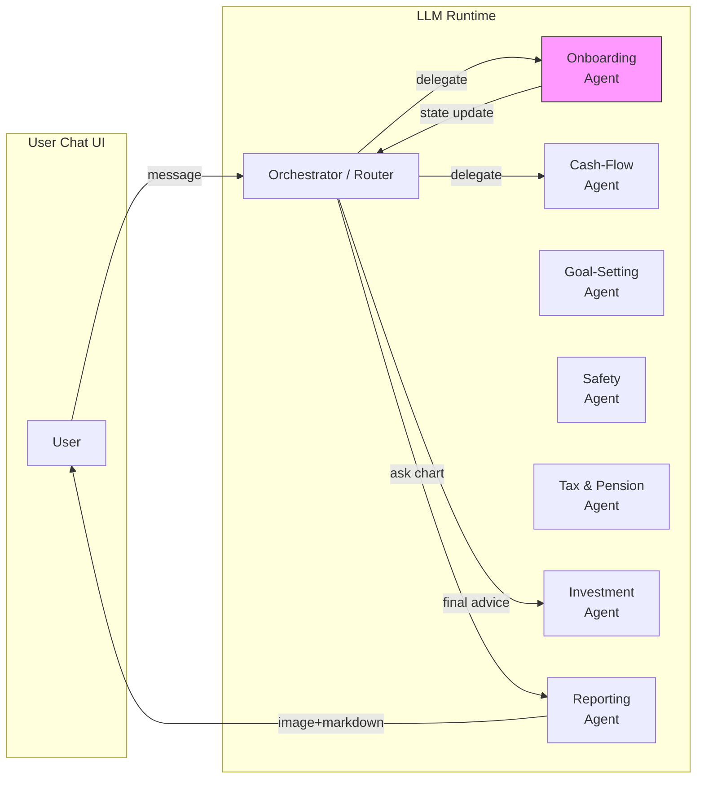

```mermaid
flowchart LR
    subgraph User Chat UI
        U[User]
    end
    subgraph LLM Runtime
        ORCH[Orchestrator / Router]
        ONB[Onboarding\nAgent]
        CFB[Cash-Flow\nAgent]
        GSA[Goal-Setting\nAgent]
        SAF[Safety\nAgent]
        TAX[Tax & Pension\nAgent]
        INV[Investment\nAgent]
        REP[Reporting\nAgent]
    end
    U-->|message|ORCH
    ORCH-->|delegate|ONB
    ONB-->|state update|ORCH
    ORCH-->|delegate|CFB
    ORCH-->|ask chart|REP
    REP-->|image+markdown|U
    ORCH-->|final advice|INV
    style ONB fill:#f9f,stroke:#333,stroke-width:1px
```